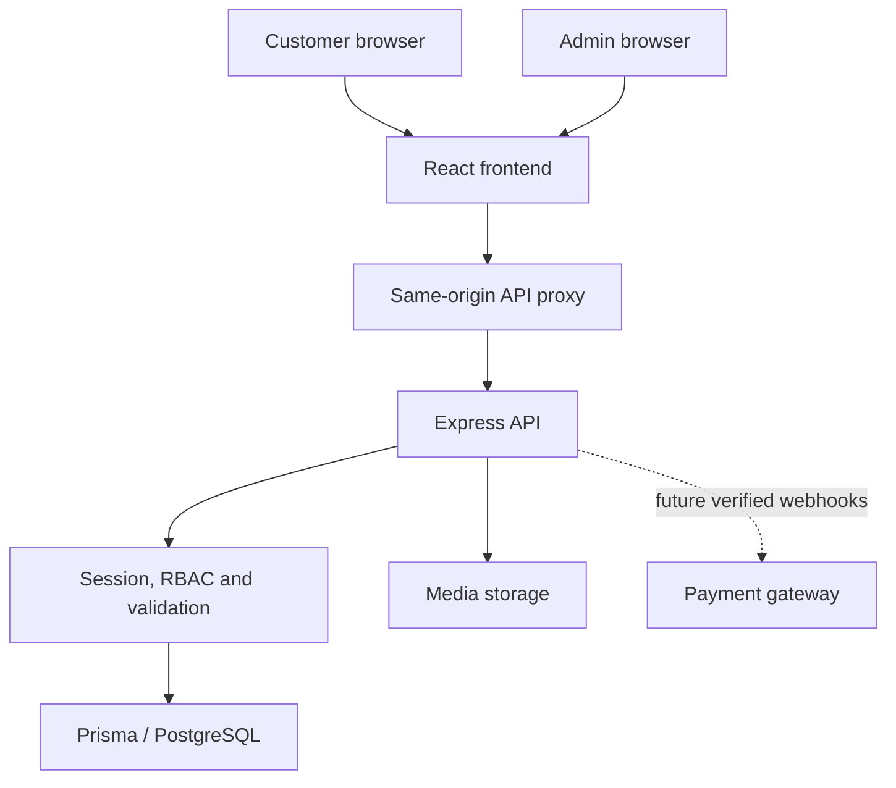
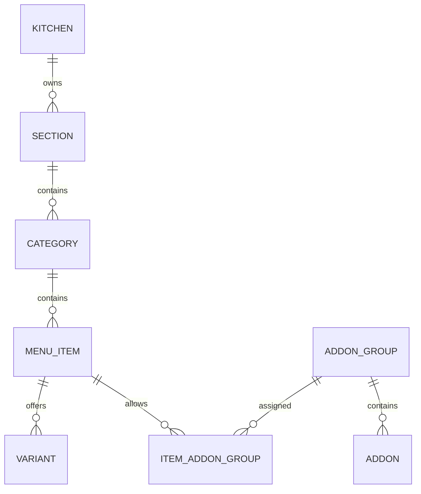
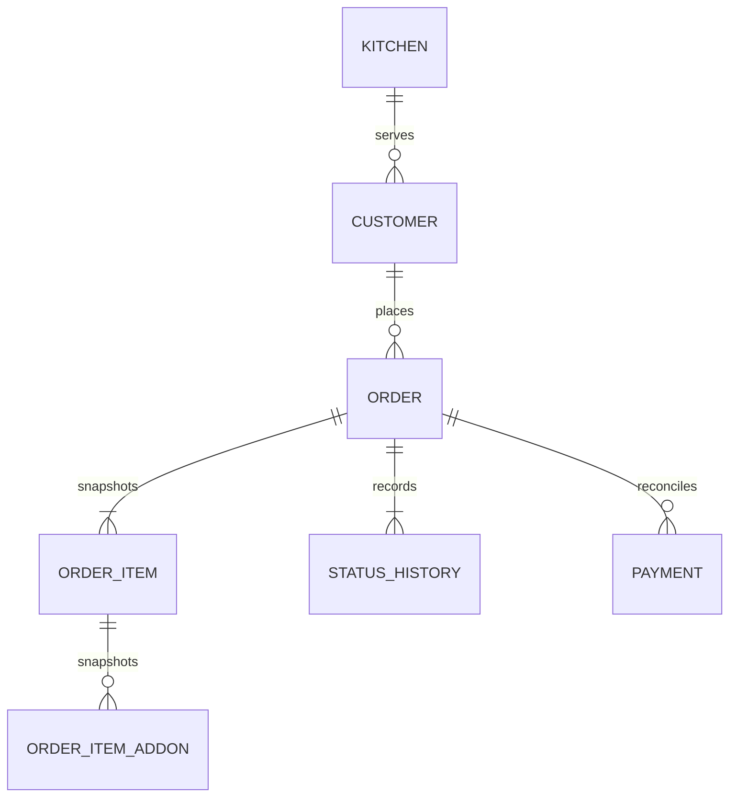

# Cloud kitchen platform — architecture and implementation record

10 September 2026. This is a **working frontend preview plus backend MVP source**, not a completed production platform. The remote PostgreSQL connection could not be reached. No tables or records were written to the user's server. No production administrator credentials were created.

## Decision labels

- **USER REQUIREMENT:** PostgreSQL, independent kitchens, backend-controlled menu/content, React/TypeScript, Express, authentication, admin/customer interfaces.
- **ARCHITECTURAL RECOMMENDATION:** modular monolith; one API; separate customer and admin routes; tenant derived from server session; PostgreSQL transactions; object storage for production media.
- **IMPLEMENTATION DECISION:** the supplied hosted frontend uses the available React + TypeScript + Vite/Vinext starter rather than a plain Vite SPA. Express remains a separate Node service. The hosted preview does not run Express or PostgreSQL.
- **IMPLEMENTATION DECISION:** current CMS/menu records use a validated JSONB entity table; orders/customers/auth are relational. This is an interim MVP design and **does not fulfil the requested fully normalized menu schema**. The proposed normalized target is in `normalized-target.sql`; it is not used by this API and must not be blindly applied as a replacement.
- **ASSUMPTION:** one kitchen per deployed frontend, slug `madhurawada`; multiple kitchen records supported by the API but no multi-brand provisioning UI. Currency INR. Ordering initially disabled. Current checkout submits an order request with manual fulfilment confirmation, not a payment or guaranteed delivered total.

## Product boundaries and implementation status

| Module | Available now | Remaining before requested production scope is met |
|---|---|---|
| Customer home/menu | Responsive hero, category menu, search, veg filtering, item detail dialog, cart | Dedicated item/category URLs, all filters, full CMS section ordering |
| Admin entry | Login form, API sessions, session-only sample mode | Provision live admin, password reset/MFA, user management UI |
| Kitchen settings | Brand text, address, hours, radius, primary colour, order enablement | Logo uploader, structured hours/holidays, validated service polygons |
| Sections/categories/items | Generic create/edit/delete/hide/sort/search/pagination | Relational normalization, SKU/slug uniqueness, all item fields, drag reorder |
| Hero/banners/about/contact/footer/SEO | CRUD forms and API | Rich section-specific fields, full public rendering, live metadata integration |
| Variants/add-ons | CRUD scaffolding and associations | Group selection rules, item assignments, customer selection, server pricing |
| Orders | Transactional item-price snapshots, manual status updates/history, duplicate key guard | Robust idempotent recovery, actual tax/delivery calculation, capacity reservation |
| Customers | Admin list, order association | Verified customer accounts, addresses/history UI, retention/deletion workflows |
| Media | Authenticated image upload with size/type/signature checks, local storage | S3/R2 signed upload, tenant access policy, malware/image decoding, cleanup |
| Coupons/testimonials | Record CRUD scaffold | Coupon validation/redemption, realistic review moderation/rendering |
| Payments/refunds | No payment captured | Gateway intents, signed/replayed webhooks, reconciliations, partial refunds |
| Dashboard | Recent loaded orders/status counts/delivered value | True timezone-aware daily/monthly aggregates, refunds, top-sellers |
| Audit | CMS/settings/order write event records | User management audit, before/after redaction policy, durable log retention |
| Inventory/subscriptions/loyalty | Deferred | Phase 3 only after core stability |

A green build does not make these pending modules complete. The admin sample does not bypass live authentication; it operates only on in-memory seed data and clearly says so. It does not persist updates to the storefront or database.

## Runtime topology



Customer browser never receives database connection strings, password hashes or session tokens in JavaScript. The frontend proxy uses server-only `BACKEND_ORIGIN`; this is an HTTP API origin, never a PostgreSQL URL. Deploy frontend and API behind one origin/reverse proxy where possible. Cookie forwarding requires matching host/path rules. Set backend `FRONTEND_ORIGIN` to the exact customer origin. Do not accept arbitrary CORS origins.

## Current database and relationships

`backend/prisma/schema.prisma` is the implementation source of truth. `backend/prisma/migrations/202609100001_initial/migration.sql` creates these tables; migration not applied remotely.

| Table | Key columns and relationships |
|---|---|
| Kitchen | UUID PK, unique slug, name, settings JSONB, timestamps |
| User | UUID PK, kitchen FK, globally unique email, Argon2 hash, role, active |
| Session | UUID PK, unique SHA-256 token hash, user FK, expiry |
| Entity | UUID PK, kitchen FK, kind, name, validated JSONB, active, sort order, soft deletion, timestamps |
| Customer | UUID PK, kitchen FK, name, phone, unique(kitchen,phone) |
| Order | UUID PK, kitchen/customer FKs, unique(kitchen,idempotencyKey), tracking hash, status, integer-paise totals, address snapshot |
| OrderItem | UUID PK, order FK, item reference snapshot, name, quantity, unit price, line total |
| OrderStatusHistory | UUID PK, order FK, status, actor, timestamp |
| AuditLog | UUID PK, kitchen FK, actor, action, entity, timestamp |

Entity menu parent references currently live in JSONB and are checked in the service, not relational foreign keys. This leaves concurrency/integrity risks and is the reason the normalized target is required. The order item ID deliberately preserves historical identity rather than following mutable names/prices. Amounts in commerce are integer paise. Modelled API item prices are decimal rupees converted at checkout; normalize prices to integer paise throughout in the next revision.

## Normalized target schema

`normalized-target.sql` is a separate design artifact, using a separate schema `cloud_kitchen_target`, not a migration to run against the current application. It specifies kitchens; users/roles/permissions/user_roles/role_permissions; sections/categories/items/variants; add-on groups/add-ons/item-group joins; media; hero/banners/about/contact/footer/testimonials/SEO; customers/addresses; orders/items/item-addons/history/payments; coupons/redemptions/audit. Composite tenant foreign keys prevent cross-kitchen references. UUIDs, timestamps, indexes, soft deletion, snapshots and money constraints are included.





Separate lifecycle: refunded is a payment outcome with an amount, not permission to reset a delivered food order. The current unpaid-order MVP rejects REFUNDED transitions. Future payment status must track NOT_PAID/AUTHORIZED/CAPTURED/PARTIALLY_REFUNDED/REFUNDED independently from kitchen fulfilment.

## API contract

All responses JSON except media. Protected requests use an HttpOnly cookie. Invalid input → 400; missing login → 401; insufficient role → 403; missing record → 404; duplicate/conflict → 409. Current generic error handling still needs refinement for unexpected 500s and observability before production.

| Method/path | Behaviour | Authorization |
|---|---|---|
| GET /api/health | Database health | Service monitor |
| POST /api/auth/login | Verify email/password, create eight-hour server session | Login limiter |
| GET /api/auth/me | Session identity | Authenticated |
| POST /api/auth/logout | Delete session and expire cookie | Authenticated |
| GET /api/public/:slug | Active CMS/menu records, scheduled-window checks | Public |
| POST /api/public/:slug/orders | Validate items, fetch DB prices, transactional customer/order/items/history | Public, rate limited |
| GET /api/public/:slug/orders/:id | Read order with secret X-Order-Token | Token possession |
| GET /api/admin/settings | Kitchen settings | Session |
| PUT /api/admin/settings | Update settings and audit | ADMIN/SUPER_ADMIN |
| GET /api/admin/content/:kind | page, limit, search, active, sort | Session |
| POST /api/admin/content/:kind | Validate, parent checks, create and audit | ADMIN/SUPER_ADMIN |
| PUT /api/admin/content/:kind/:id | Tenant-scoped update and audit | ADMIN/SUPER_ADMIN |
| DELETE /api/admin/content/:kind/:id | Soft delete; reject referenced parent | ADMIN/SUPER_ADMIN |
| GET /api/admin/orders | Last 50, status/page | Session |
| PATCH /api/admin/orders/:id/status | Compare current state, update/history/audit in transaction | Session including STAFF |
| GET /api/admin/customers | Latest 100 customers | ADMIN/SUPER_ADMIN |
| GET /api/admin/audit | Latest 100 events | ADMIN/SUPER_ADMIN |
| POST /api/admin/media | Multipart `image`, 5 MB, JPG/PNG/WebP | ADMIN/SUPER_ADMIN |

Kinds: sections, categories, items, variants, addon-groups, addons, hero, banners, about, contact, footer, seo, testimonials, coupons, media. Universal CMS form accepts name/description/active/sortOrder/image and kind-specific price/parent/flags. This is not the entire requested per-entity CRUD contract: get-by-ID, many rich fields and customer/user management remain to be implemented.

Example item create body (IDs must come from the authenticated kitchen):

```json
{"name":"Andhra Veg Meals","description":"Rice, dal, vegetable curry and curd","categoryId":"UUID_FROM_CATEGORY_API","price":150,"veg":true,"active":true,"sortOrder":0,"prepTime":25}
```

Order input: name, Indian mobile number, address, optional note, UUID idempotencyKey, array of `{id,quantity}`. The client does not supply prices or totals. Kitchen slug is resolved publicly; tenant identity for admin writes always comes from the stored session. Never trust a kitchenId posted by an administrator or customer.

## Authentication and security

Implemented: Argon2 password hashing; 256-bit random session secrets stored hashed; eight-hour expiry; HttpOnly, SameSite=Strict, production Secure cookie; logout invalidation; active-user check; role middleware; login/global/order rate limits; origin allowlist; strict input validation; parameterized Prisma operations; minimal customer data; audit records; transaction-based order history; server-price lookup; media size and signature limits.

Required before production: CSRF token strategy and proxy-origin validation tests; distributed rate limiting; session cleanup and session/device revocation; password-reset and optional MFA; least-privilege DB account; database-enforced tenant relationships; concurrency tests for delete/reparent/order placement; verified phone/account ownership; immutable request hash for idempotency; business-day timezone; validated delivery fee and fulfilment rules; payment-webhook authenticity/replay protection; privacy/retention policies; backup restore drill; structured error monitoring. Never publish the password given in chat. Rotate it before any real deployment and replace the PostgreSQL superuser with a dedicated application account.

No customer PII is in seed data. No synthetic reviews or fake order revenue are seeded. Images are illustrative and credited, not claimed photographs of the sister's cooking.

## Media and SEO

Current development media lives outside PostgreSQL under `UPLOAD_DIR`; metadata is a tenant-owned CMS record. Public food photos should be public-read; private documents need separate storage and authorization. Recommended production: S3-compatible storage (S3 or R2), random object keys prefixed by kitchen UUID, private upload credentials, signed short-lived upload requests, image decode/re-encode, size/pixel limits, CDN and orphan cleanup. SVG is intentionally not accepted by the upload route.

Target SEO: unique published slugs, per-kitchen canonical origin, title/description/OG fields, sitemap/robots, correctly scoped FoodEstablishment/Menu structured data only for verified business details. Current sample has generic metadata; CRUD SEO entries are not yet wired into server metadata. Do not advertise unverified opening hours, reviews, licences or health properties in structured data.

## Deployment and operations

1. Frontend: Sites preview available; production alternative is Vite static hosting with same-origin reverse proxy to API. The current Vinext build requires its compatible Worker runtime.
2. API: Node 22/24 container/VPS, non-root runtime, TLS termination, process supervision, persistent uploads for development. Worker frontend alone cannot execute the separate Express service.
3. PostgreSQL: private network or tightly restricted TLS endpoint; dedicated database/schema and least-privilege roles. Migration account separated from runtime account. Inspect existing schema first. Do not reset/drop an existing database.
4. Secrets: backend DATABASE_URL only, deployment secret manager, no frontend VITE_/NEXT_PUBLIC_ secret variables. BACKEND_ORIGIN server-side proxy setting. Email/password used only for one-time secure admin seeding.
5. Operational recommendations: daily encrypted backup plus WAL/PITR where available, initial RPO ≤1 hour and RTO ≤4 hours as goals to test—not guarantees; monthly restore drill; alert on API errors, DB saturation, order backlog and payment mismatch; log request IDs without cookies/PII.
6. CI target: install locked deps, generate Prisma client, lint/types, domain tests, ephemeral PostgreSQL migration/integration tests, frontend build, image/secret scanning, deploy migrations then API/frontend compatible release. Keep rollback schema-compatible.

No server purchase, payment-account creation, DNS change or paid integration was performed.

## Source structure

```text
app/
  page.tsx                 customer storefront + cart
  admin/page.tsx           admin workspace and sample mode
  api/[...path]/route.ts   server-side Express proxy
  media/[file]/route.ts    public image proxy
  globals.css             responsive brand/admin styling
lib/kitchen.ts             shared client API/types
shared/seed.json           clearly labelled kitchen sample content
backend/
  src/server.ts           API/auth/CRUD/order/media MVP
  src/domain.ts           money/state rules
  src/domain.test.ts      focused business rule tests
  src/seed.ts             non-overwriting seed + administrator
  prisma/schema.prisma
  prisma/migrations/
  .env.example
  package.json
  tsconfig.json
docs/
  architecture.md
  normalized-target.sql
  business-feasibility.md
  financial-model.py
  financial-model.md
  financial-results.json
```

The backend still has routes in one server file; split into module routes/controllers/services/repositories as normalized modules are implemented. Do not call the present structure the final modular monolith.

## Development roadmap and release gates

- Stage 0: premises/demand pilot. Complete actual 30-day evidence before business expansion.
- Stage 1A: regain authorized database connectivity; inspect existing contents; create dedicated schema; migrate/seed; validate authentication and CMS round trips.
- Stage 1B: normalized menu tables and foreign keys; per-kind complete validation/forms; rich CMS; variant/add-on customer selections; robust inventory-free availability and capacity rules.
- Stage 1C: checkout with serviceability, server tax/delivery, idempotency and order tracking UI; user/staff management; operational aggregate dashboard; integration tests for tenant isolation, races and rollback.
- Stage 2: verified customer accounts, payment gateway/webhooks/reconciliation, coupons/redemptions, real testimonials, delivery integration and analytics.
- Stage 3: inventory ledger/recipe consumption, subscriptions, loyalty, multi-kitchen provisioning and marketing automation only after production stability.

Major technical risks: JSONB parent integrity, unverified migrations, tenant leakage from future unscoped queries, in-memory rate limits across replicas, local media loss, duplicate payment/order events, timezone errors, stale price/availability caching, insufficient error recovery, generic CMS fields outrunning validation. Major business risks and stage gates are in the feasibility report.
